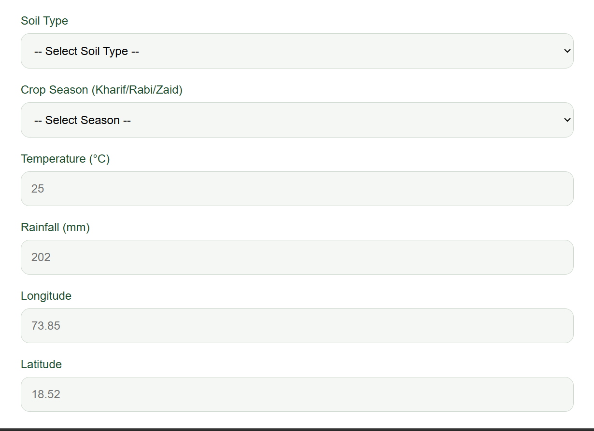
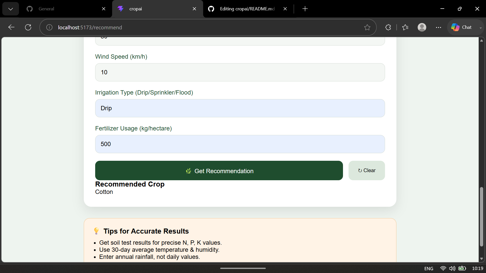

# 🌱 Smart Crop Recommendation System

An AI-powered crop recommendation platform that helps farmers and agricultural enthusiasts identify the most suitable crop based on soil nutrients and environmental conditions.

## 📌 Overview

The Smart Crop Recommendation System uses a Machine Learning model trained on agricultural data to recommend the best crop for cultivation. Users enter parameters such as Nitrogen (N), Phosphorus (P), Potassium (K), temperature, humidity, pH, and rainfall, and the system predicts the most appropriate crop.

## 🚀 Features

* Machine Learning-based crop prediction
* Interactive and responsive React frontend
* Flask backend API integration
* Real-time prediction results
* User-friendly interface
* Fast and accurate recommendations

## 🛠️ Tech Stack

### Frontend

* React.js
* Vite
* HTML5
* CSS3
* JavaScript

### Backend

* Flask
* Python

### Machine Learning

* Scikit-Learn
* Pandas
* NumPy

## 📂 Project Structure

cropai/

├── backend/

│   ├── app.py

│   ├── model.pkl

│   └── requirements.txt

├── src/

├── public/

├── package.json

└── README.md

## 📸 Screenshots

### Home Page


### Prediction Form




### Recommendation Result



## ⚙️ Installation

### Clone Repository

```bash
git clone https://github.com/AryaJadhav5/cropai.git
cd cropai
```

### Backend Setup

```bash
cd backend
pip install -r requirements.txt
python app.py
```

### Frontend Setup

```bash
npm install
npm run dev
```

## Future Enhancements

* Weather API integration
* Fertilizer recommendation system
* Crop disease prediction
* User authentication
* Historical prediction tracking

## Author

Arya Jadhav

BCA Student | Full Stack Developer | Machine Learning Enthusiast

